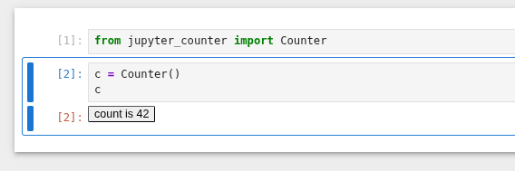

# `jupyter-rust-widgets`

Experiment in implementing Jupyter widgets fully in Rust.

## How it actually works

```
$ wasm-pack build ./jupyter_counter_frontend --target web --out-dir pkg
$ env -C ./jupyter_counter_frontend webpack
```

creates single javascript blob that exports `JupyterCounter.render_counter` function.

```
$ env -C ./jupyter_counter maturin build
```
will read that blob at compile time (thus frontend must be compiled before the python module) and embed as the js module driving the frontend of the widget as well as build a native python module that can communicate with the frontend widget.

Communication happens via JSON objects, handled by `serde_json` on both sides.
`jupyter_counter_types` crate contains message definitions that are shared between frontend and backend code.


